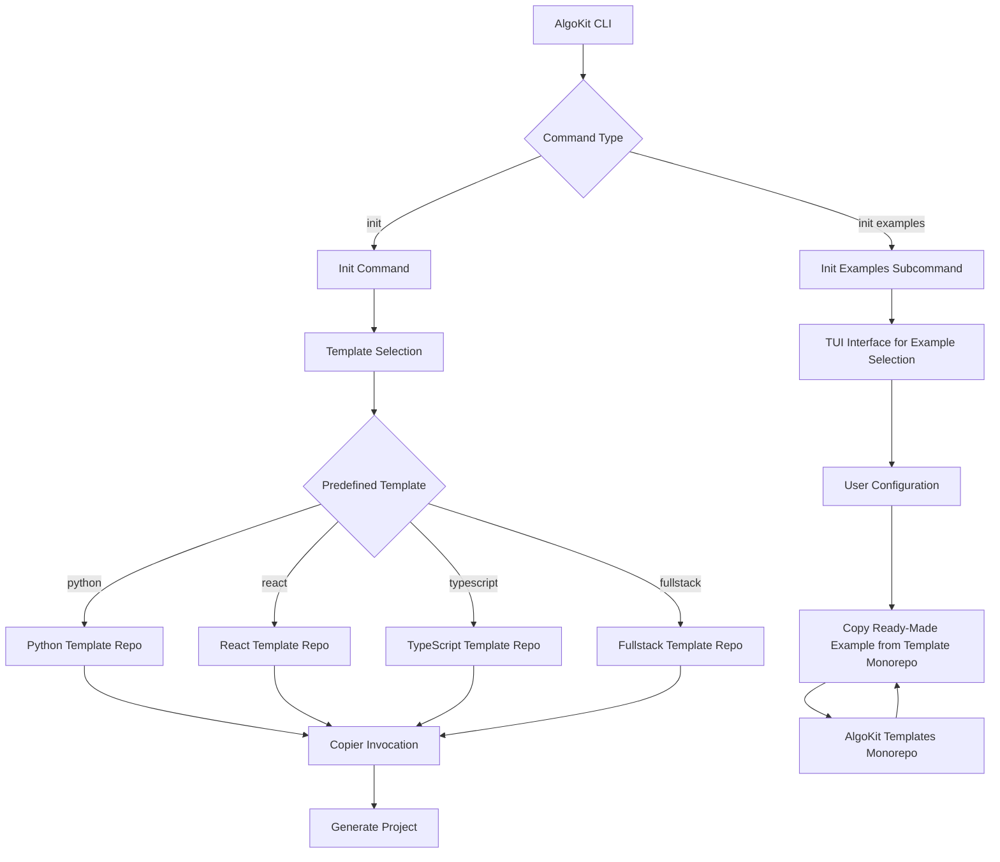
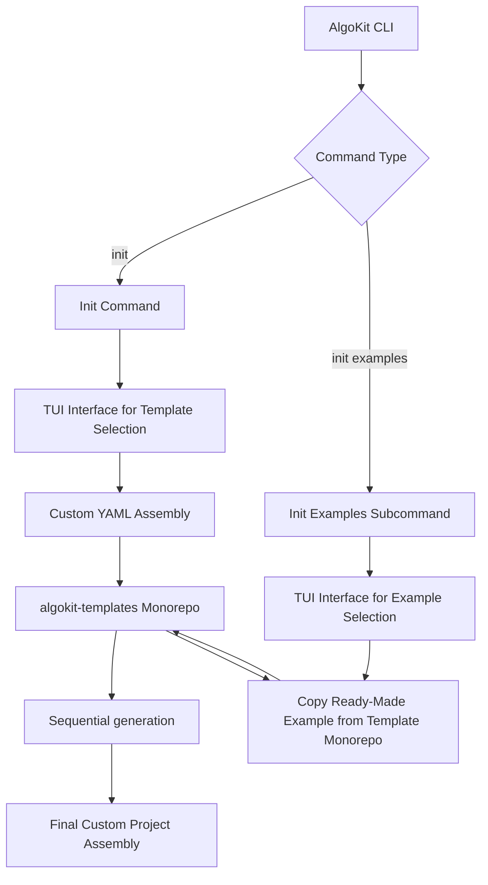
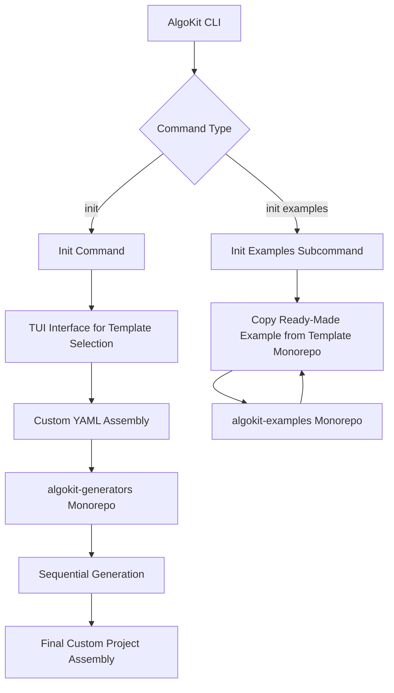
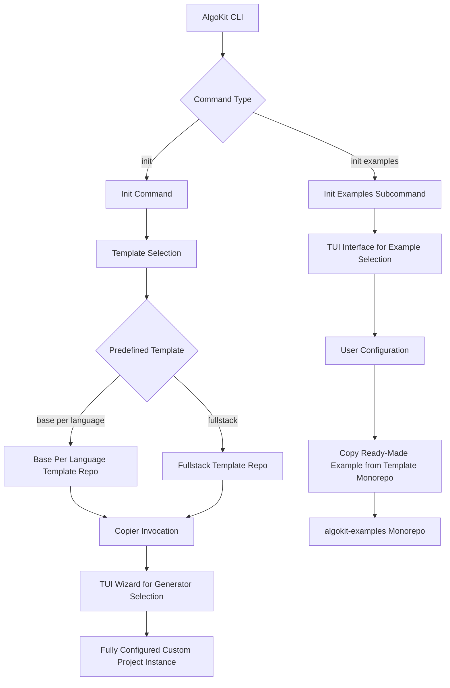
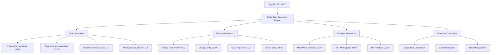

# Transition to Modular Generator System for `AlgoKit` Project Architecture

## Context and Problem Statement

The `AlgoKit` ecosystem currently uses a template-based architecture where projects are generated from monolithic templates. How can we evolve this system to provide better modularity, incremental enhancement capabilities, and user control while maintaining the current feature set and user experience? The current system has limitations in diff preview, conflict detection, compatibility management, and feature status tracking that need to be addressed.

## Decision Drivers

* **Developer Experience**: Need for incremental project building, diff preview before changes, and clear feature status tracking
* **Modularity Requirements**: Features should be composable, idempotent, and applicable at any point in project lifecycle
* **Multiple User Workflows**: Support TUI wizard for beginners, CLI commands for experienced developers, and configuration files for teams
* **Maintenance Burden**: Current template duplication across repositories creates significant maintenance overhead
* **Self-Contained Execution**: Eliminate manual dependency installation requirements
* **Backward Compatibility**: Maintain existing functionality while transitioning to new architecture

## ADR Glossary

> Glossary of terms used within this ADR, including existing concepts as well as new terminology relevant to generators proposal in option 1. The glossary will be updated to reflect which *new* terms will take effect depending on decision in the ADR.

**Project**: An `AlgoKit`-managed codebase that contains one or more related applications or components for Algorand development. A project is defined by the presence of an `.algokit.toml` configuration file and can be structured as either a single-purpose project (containing only smart contracts OR only frontend code) or a workspace project (containing multiple related sub-projects such as both smart contracts and frontend applications). Projects track their applied generators, configuration, and metadata through the `.algokit.toml` file, enabling incremental enhancement and state management throughout the development lifecycle.

**Example Project**: A fully-hydrated `AlgoKit` project that demonstrates a complete, functional implementation of a specific use case or pattern. Example projects are created by applying base, feature, and example generators in sequence to produce ready-to-run applications that serve as both reference implementations for developers and entries in the `AlgoKit` gallery.

**Generator**: A self-contained, modular unit that applies a specific set of transformations to create or modify project files, configurations, and structure. Generators are designed to be idempotent, meaning they can be executed multiple times on the same project without causing unintended side effects - subsequent runs will either produce the same result or gracefully handle existing configurations without duplication or corruption.

**Base Generator**: These generators establish the foundational structure and core functionality for different project types - either smart contracts or frontend applications. They create the essential scaffolding that defines the project's primary purpose, including language-specific boilerplate, dependency management files, and basic project structure. Base generators provide the minimal viable starting point upon which other generators can build.

**Feature Generator**: Modular units that add specific development capabilities to existing projects. These generators enhance projects with cross-cutting concerns such as testing frameworks, linting configurations, code formatting tools, CI/CD pipelines, development containers, or documentation structures. Feature generators are designed to work with any compatible base generator and can be applied independently and incrementally throughout the project lifecycle.

**Example Generator**: These generators apply domain-specific code and configurations to demonstrate particular use cases or architectural patterns. They transform a base project into a fully-functional application by adding business logic, sample implementations, and complete working features. Example generators showcase best practices and provide developers with ready-to-run applications that illustrate real-world scenarios like digital marketplaces, NFT collections, or DeFi applications.

## User Workflows Requirements

### Workflow 1: Interactive TUI Wizard

As a developer new to Algorand, I want to use an interactive wizard that guides me through project creation, so that I can easily select the features I need without understanding all the technical details upfront. The wizard should present me with clear options for project type, language preferences, and additional features like testing frameworks, linting tools, and IDE configurations. After creating my initial project, I should be able to run commands like `algokit project add testing` or `algokit project add linting` to incrementally enhance my project with new capabilities.

### Workflow 2: Incremental Command-Line Building

As an experienced developer, I want to build my project incrementally using explicit commands, so that I have full control over the project structure and can automate the process in CI/CD pipelines. I should be able to start with `algokit project add workspace` to create a workspace structure, then add components like `algokit project add base --contracts --python` for smart contracts and `algokit project add base --frontend --react` for the frontend. This approach allows me to build exactly what I need, when I need it, and understand each layer being added to my project.

Example commands:

```bash
# Creates workspace structure
algokit project add workspace

# Adds Python contract base
algokit project add base-contracts-python

# Adds TypeScript contract base
algokit project add base-contracts-typescript

# Adds React frontend base
algokit project add base-frontend-react

# Auto-detects project type and adds testing
algokit project add testing

# Adds linting configuration
algokit project add linting

# Adds formatting configuration
algokit project add formatting
```

### Workflow 3: Configuration-Based Generation

As a team lead or architect, I want to define my project structure in a configuration file and generate consistent projects from it, so that my team can quickly spin up standardized projects that follow our architectural patterns. I should be able to create a YAML configuration that specifies all the generators to apply in sequence, including base templates, example code, and features. This configuration should be versionable, shareable, and reproducible across different environments, enabling commands like `algokit project generate --config my-template.yml`.

## Current System Overview



## Current Gaps

### Diff Preview and Approval System

The current implementation applies changes directly without showing users what will be modified. There is no mechanism to preview changes before they are applied, and no approval workflow exists. This makes users hesitant to run generators on existing projects as they cannot predict the impact.

### Intelligent Conflict Detection

While Copier provides basic file overwrite warnings, there is no intelligent detection of feature conflicts. The system cannot determine if a feature has already been added by examining project configuration or file patterns. This can lead to duplicate configurations or broken setups when features are added multiple times.

### Scattered Feature Status Tracking

Feature configuration is distributed across multiple files (`.copier-answers.yml`, `.algokit.toml`, `pyproject.toml`, `package.json`). There is no single command to view all enabled features and their status. Users must manually inspect multiple files to understand their project configuration.

## Considered Options

* **Option 1: Flat Generator Architecture with State in .algokit.toml** - Transform current templates into independent generators with centralized state management
* **Option 2: Dedicated generators monorepo with support for both inline and remote generators** - Extension to Option 1 with separate monorepos for generators and examples
* **Option 3: Hybrid approach enhancing existing standalone templates and remote generators** - Enhancement of existing patterns with gradual introduction of modularity
* **Option 4: CLI-Integrated Generator Engine** - All generators embedded within CLI binary to eliminate external version dependencies

## Decision Outcome

To be decided. Current AlgoKit Core and MakerX Engineer team consensus is to pursue Option 2 and consider migrating to Option 4 in the longer term.

### Confirmation

Implementation success will be confirmed through:

* Successful generation of all current example projects using the new generator architecture
* Validation that all existing template features are preserved and functional
* User acceptance testing of the three primary workflows (TUI, CLI, configuration-based)
* Compatibility testing with existing `AlgoKit` projects

## 1. Flat Generator Architecture with State in .algokit.toml

Transform the current template system into a flat generator architecture where every feature (workspace setup, base templates, testing, linting, etc.) is implemented as an independent, composable generator. State management is centralized in the project's `.algokit.toml` file, providing transparency and version control friendliness. Enforce proper JSON schema for all configuration files including `.algokit.toml` and introduce explicit validation of the schemas in the cli during project metadata parsing.

### Schema-Driven Configuration

This option introduces formal JSON schemas for both project configuration and template definitions:

* **Project Configuration Schema**: Defines the structure of `.algokit.toml` files with generator tracking, version management, and validation rules. See [algokit-toml-schema.json](assets/ADR_001/algokit-toml-schema.json) for the complete specification.

* **Template Configuration Schema**: Defines reusable project templates that specify generator sequences for common project patterns. See [template-config-schema.json](assets/ADR_001/template-config-schema.json) for the complete specification.

* **Configuration Examples**: Reference implementations showing typical project configurations and template definitions are available in the [assets/ADR_001/](assets/ADR_001/) folder.



### Migration and Backward Compatibility

#### Impact on Existing Templates

Currently, `AlgoKit` templates are maintained as individual GitHub repositories containing full Copier templates. These standalone repositories will undergo a phased deprecation process, remaining functional but marked as deprecated initially, then archived after the `--legacy` flag is removed from the CLI.

All Algorand Foundation maintained templates will be migrated to the new generator architecture and consolidated within the main `algokit-templates` repository. Each template's functionality will be decomposed into appropriate base, feature, and example generators to maintain feature parity while improving modularity.

While custom generator creation through the legacy mechanism will no longer be supported, the underlying Copier functionality remains available. The `--template-url` and `--template-url-ref` flags will continue to function for direct Copier template usage, and community templates can still be created as Copier projects and used via `--template-url`. Since generators themselves are Copier projects, community-created generators can theoretically be consumed through these flags.

The specifics of community generator integration and distribution mechanisms are considered out-of-scope for this initial architecture transition and will be addressed in future iterations.

#### Migration Path

The migration to the new generator architecture will be managed primarily through the CLI, with a focus on introducing new functionality without breaking existing workflows until the next major version. The key mechanism for this transition is the introduction of a `beta` command group.

The beta command group provides access to features that are functionally complete but may still undergo changes before being considered stable. These features are in active development and testing, allowing early adopters to experiment with new functionality while maintaining access to stable commands for production use. To use a beta command, users prepend `beta` to the command group, such as `algokit beta init`, which will eventually replace the current `algokit init` with the new TUI workflow.

New commands that don't conflict with existing functionality will be added directly without the need to enable tui feature flag via config command group:

* `algokit project add {generator-name}` - Adds generators to existing projects.

This command structure replaces the `algokit generate` workflow for project scaffolding, as `add` better describes the action of layering functionality onto an existing project, while `generate` implies creating something from scratch or producing standalone artifacts.

The existing `algokit generate` command will be deprecated for project generator use in favor of `algokit project add`, though it will continue to function for generating app clients. The new project build process will only guarantee compatibility with projects created using the new generators. While `algokit project add` can be used with older projects, users will receive a warning that this is not recommended, encouraging migration to the new architecture for optimal results.

#### Justification for Dropping Legacy Generators

The decision to drop legacy generators stems from fundamental maintenance and complexity issues inherent in the current architecture. Legacy generators must be embedded within each project and exist separately in every repository, creating significant code duplication that becomes increasingly difficult to maintain as the number of project examples grows. Additionally, the legacy generators add unnecessary complexity to the templates themselves - the current templates already use Jinja templating which is difficult to understand, and the generators in the `.algokit` folder compound this complexity by also using Jinja templating, making it challenging for developers to comprehend what the generators are actually doing and how they transform the project.

### Community Extensibility

Community generator integration and distribution mechanisms fall outside the scope of this initial architecture transition. Future iterations will address how community members can create, share, and discover custom generators, along with the protocols and infrastructure needed to support a thriving ecosystem of third-party generators.

## 2. Dedicated generators monorepo with support for both inline and remote generators

The proposal is an extension to all proposals in Option 1 with the following differences:

* Introduce a dedicated monorepo for all user-facing generators under new repository called `algokit-generators`. The monorepo can reuse already established CI/CD and infrastructure from `algokit-templates` for scaffolding generators and end-to-end testing them.
* Rename existing `algokit-templates` to `algokit-examples` OR merge with app gallery repository to keep examples used in App Gallery aligned to consumption by App Gallery instead of aiming to serve 2 distinct purposes.
* Identical to Option 1, rename generator section to project.generators, but maintain support for inline generators. CLI should still behave as is when it discovers an inline generator in the section, giving existing template builders the ability to continue leveraging this use case for scenarios when they have no need for managing and setting up infrastructure for remote generators.
* Modify path parameter in generator schema under `algokit.toml` to accept paths OR GitHub URLs. This allows supporting remote generators hosted in external repositories. This ensures that not only is support for inline generators preserved, but the concept of remote generators introduced with the monorepo approach is also extended to allow custom community generators to be easily integrated and used.
* The proposal also slightly modifies the beta feature flag approach in option 1. Instead of explicitly introducing temporary cli semantics via `algokit beta init`, the proposal is to introduce a `algokit config beta` command group to represent beta feature flags for tui based wizard. The feature flag command group provides access to features that are functionally complete but may still undergo changes before being considered stable. These features are in active development and testing, allowing early adopters to experiment with new functionality while maintaining access to stable commands for production use. To enable beta feature, users execute `algokit config beta tui-wizard` to enable it, afterwards regular algokit init switches to the new TUI based workflow. The difference from option one is that this approach does not require introducing temporary semantics into user facing cli commands, while leveraging an already established `config` command group for. The `algokit config beta` allows a convenient central place to lookup preview feature flags and have consistent way to opt into preview functionality as well as a command group to leverage for any new preview features that may be required in future.



## 3. Hybrid approach enhancing existing standalone templates and remote generators

The following approach borrows ideas from previous options but proposes enhancement of existing patterns over radical architecture revamp.

* Define a notion of lowest common denominator for a base template per each algokit supported programming language. Strip down existing algokit react typescript and python templates to baseline versions removing all Preset templatization (no testing, cicd, linting, formatting and etc) - just the bare minimum starter structure that can be easily extended. This follows principles from option 1 to extract all non essential capabilities into general purpose building blocks.
* Maintain standalone base template repository as a base for enforcing workspace mode structure. Rename into `algokit-base-workspace-template`.
* Enhance `algokit-fullstack-template` to act as a bundler for a set of approved pairs of standalone base templates. To a large extend it already acts as one, however removing templatization from base templates significantly simplifies full stack copier.yaml configuration and maintenance costs (less duplicated template answers to manage, clear determenistic number of base templates it can pair up together).
* Similar to option 2. Introduce a dedicated monorepo for all user facing generators under new repository called `algokit-generators`. The monorepo can reuse already established ci cd and infrastructure from `algokit-templates` for scaffolding generators and e2e testing them.
* Similar to option 2. Rename existing `algokit-templates` into `algokit-examples` OR merge with app gallery repository to keep examples used in App Gallery close to and purposefully aligned to consumption by App Gallery instead of aiming to serve 2 distinct purposes.
* Maintain existing non tui based init wizard flow, ensuring it remains functional and accessible for users who prefer a command-line interface. Keep tui based wizard separate and optionally invocable by user after completion of init flow. This ensures that all users always start with a bare minimum and can conveniently select **only** what they need after instantiation of the template. TUI interface for generators can be invoked at any point in existing project lifecycle, in contrast with Option 1 and 2 where TUI based wizard is used primarily as a replacement for initial init flow.
* Introduce `algokit project add` functionality identical to proposal in Options 1 and 2 allowing invoking inline and remote generators post initialization of the base template.



## 4. CLI-Integrated Generator Engine

The proposed option takes inspiration from Ruby on Rails generators ecosystem that solves versioning challenges by tightly coupling generator versions with the CLI version.

Transform the `AlgoKit` architecture by embedding all generators directly within the CLI binary itself, eliminating external dependencies and version coordination challenges. This approach treats generators as internal CLI components rather than external artifacts, achieving version alignment and reliability through monolithic design.

All generators are bundled inside the CLI binary itself, eliminating ALL external version dependencies and failure modes. This creates a monolithic system where CLI version equals generator versions, removing temporal incompatibility entirely.



### Addressing concerns on supporting external generators

The cli will still depend on leveraging copier functionality internally in order to invoke rendering of bundled jinja templates. Support for instantiation of external templates via --template-url as well as external remote and inline generators can remain intact.

## Pros and Cons of the Options

### Option 1: Flat Generator Architecture with State in .algokit.toml

*Good*, because provides complete modularity with idempotent generators that can be applied at any project lifecycle stage

*Good*, because enhances generators state tracking under `.algokit.toml` file for clear project state visibility

*Good*, because eliminates code duplication across templates, significantly reducing maintenance burden

*Good*, because enables diff preview/dry-run and user approval workflows before applying changes

*Good*, because supports all three user workflows: TUI wizard, CLI commands, and configuration files

*Good*, because it formalizes project configurations with JSON schemas allowing strict config files validation (see [schema definitions](assets/ADR_001/))

*Neutral*, because requires learning new command patterns (`algokit project add` vs current workflows)

*Neutral*, because the option proposes a single monorepo to serve as a reference to app gallery examples but also all user facing generators. Increased complexity of contributing new examples may arise.

*Neutral*, because it removes explicit notion of 'Template' by turning standalone templates into granular generators. The new Template term becomes applicable to a configuration file that defines order of generator execution.

*Bad*, because requires significant architectural refactoring of existing templates accounting for large variety of edge cases and enforcing unique constraints by introducing a notion of portable remote generator.

*Bad*, because community generator extensibility is deferred to future implementation phases

*Bad*, because legacy generators will be deprecated, requiring migration effort from existing projects

### Option 2: Dedicated generators monorepo with support for both inline and remote generators

*Good*, because provides complete modularity with idempotent generators that can be applied at any project lifecycle stage

*Good*, because enhances generators state tracking under `.algokit.toml` file for clear project state visibility

*Good*, because eliminates code duplication across templates, significantly reducing maintenance burden

*Good*, because enables diff preview/dry-run and user approval workflows before applying changes

*Good*, because supports all three user workflows: TUI wizard, CLI commands, and configuration files

*Good*, because it formalizes project configurations with JSON schemas allowing strict config files validation (see [schema definitions](assets/ADR_001/))

*Good*, because the option streamlines maintainability of the repository by splitting algokit-templates into 2 distinct monorepos serving distinct purposes: one for examples on app gallery, one for generic user facing remote generators.

*Good*, because inline generators are still supported and can be used alongside remote generators.

*Good*, because remote community generator extensibility is supported with a minimal modification to the existing generator interface.

*Neutral*, because requires learning new command patterns (`algokit project add` vs current workflows)

*Neutral*, because it removes explicit notion of 'Template' by turning standalone templates into granular generators. The new Template term becomes applicable to a configuration file that defines order of generator execution.

*Bad*, because requires significant architectural refactoring of existing templates accounting for large variety of edge cases and enforcing unique constraints by introducing a notion of portable remote generator.

### Option 3: Hybrid approach enhancing existing standalone templates and remote generators

*Good*, because it preserves existing standalone template infrastructure while gradually introducing modularity, reducing migration risk

*Good*, because it maintains backward compatibility with current CLI workflows while adding new TUI capabilities as an optional enhancement

*Good*, because stripping templates to baseline versions significantly reduces maintenance burden while keeping familiar repository structure

*Good*, because it allows users to start with bare minimum templates and incrementally add only needed features through post-init TUI wizard

*Good*, because it simplifies fullstack template maintenance by removing duplicated template answers and managing deterministic base template pairs

*Good*, because it provides clear separation between base templates (standalone repos) and generators (monorepo), making the architecture easier to understand

*Good*, because it supports both inline and remote generators, providing maximum flexibility for different use cases and community extensions

*Good*, because it formalizes project configurations with JSON schemas allowing strict config files validation (see [schema definitions](assets/ADR_001/))

*Neutral*, because it maintains multiple repositories (base templates + generators monorepo) which could be seen as either good separation of concerns or added complexity

*Bad*, because it still requires maintaining separate template repositories even if simplified. Maintenance cost is a subject to proper evaluation, a counter argument is significant reduction in maintenance due to complete removal of any templatization logic that can be generalized in a remote generator.

*Bad*, because having both standalone templates and generators could lead to feature fragmentation where some capabilities exist in templates and others in generators. This could be mitigated by establishing clear conventions around what should be included in base standalone templates vs moved to portable generators.

*Bad*, because requires significant architectural refactoring of existing templates accounting for large variety of edge cases and enforcing unique constraints by introducing a notion of portable remote generator.

### Option 4: CLI-Integrated Generator Engine

*Good*, because eliminates ALL external version dependencies by embedding generators within CLI binary

*Good*, because achieves temporal compatibility - CLI version equals generator versions

*Good*, because eliminates team version drift through single version coordinate (CLI version)

*Good*, because enables enforced dependency validation and conflict detection at the engine level

*Good*, because provides superior user experience in offline scenarios since all resources are bundled with the CLI

*Good*, because guarantees atomic testing - all generators tested as part of CLI CI/CD workflows

*Good*, because enables maintenance reduction by eliminating template repository duplication

*Good*, because community template/generator extensibility including support for remote/inline generators remains intact

*Bad*, because completely eliminates community template extensibility without CLI forks

*Bad*, because significantly increases development barrier for template contributions

*Bad*, because ties all generator changes to CLI release cycles, affecting development velocity

*Bad*, because it does not eliminate temporal compatibility and versioning issues for third party templates/generators. However, this can be mitigated by providing clear guidelines and tools for maintaining compatibility across versions.

*Bad*, because requires significant architectural refactoring of existing templates accounting for large variety of edge cases and enforcing unique constraints by introducing a notion of portable remote generator.

## More Information

### Option 1 Implementation Details

For detailed implementation specifications of the "Flat Generator Architecture with State in .algokit.toml" option, including functionality distribution, repository structure, and workflow implementation flows, see [Option 1 Implementation Details](assets/ADR_001/option-1-implementation-details.md).

#### Configuration Schema Definitions

The implementation of Option 1 requires formal JSON schema definitions for configuration validation:

#### AlgoKit Project Configuration Schema (.algokit.toml)

* JSON Schema: [algokit-toml-schema.json](assets/ADR_001/algokit-toml-schema.json)
* Example Configuration: [algokit-toml-example.toml](assets/ADR_001/algokit-toml-example.toml)

#### AlgoKit Template Configuration Schema

* JSON Schema: [template-config-schema.json](assets/ADR_001/template-config-schema.json)
* YAML Example: [template-config-example.yml](assets/ADR_001/template-config-example.yml)
* TOML Example: [template-config-example.toml](assets/ADR_001/template-config-example.toml)

These schemas formalize project configurations with strict validation, ensuring consistency across the AlgoKit ecosystem and enabling precise tooling support.

### Option 2 Implementation Details

The given option builds on top of the implementation details proposed in Option 1, hence no additional implementation details are provided here.

> Assumes JSON schema definitions and validation mechanisms similar to Option 1 are in place.

### Option 3 Implementation Details

The given option builds on top of the currently established behaviour in the `AlgoKit` ecosystem, leveraging partial implementation details established in Options 1 and 2. Hence no additional implementation details are provided here.

> Assumes JSON schema definitions and validation mechanisms similar to Option 1 are in place.

### Option 4 Implementation Details

Option 4 represents a fundamental architectural shift requiring complete CLI restructuring. The high level approximation of implementation involves:

* **Generator Engine Integration**: Embedding a full generator coordination engine within the CLI binary
* **Template Decomposition**: Similar to Option 1-3 involves converting all existing standalone templates into embedded generator modules
* **Dependency Management**: Implementing runtime dependency validation and conflict detection
* **State Management**: Centralizing all project state in .algokit.toml with CLI version locking
* **Migration Tooling**: Providing tools to migrate existing projects to the new embedded generator system

The implementation complexity is equally significant to Options 1-3 with added complexity of bundling artifacts within the CLI. All existing template repositories would be archived and their functionality absorbed into the CLI codebase.

> Assumes JSON schema definitions and validation mechanisms similar to Option 1 are in place.
